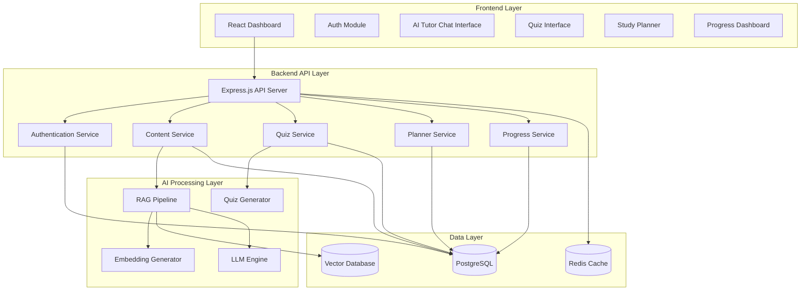

# Design Document: VidyaAI Platform

## Overview

VidyaAI is a curriculum-grounded multilingual AI learning platform that transforms NCERT and State Board textbooks into an interactive learning experience. The platform uses Retrieval-Augmented Generation (RAG) to provide accurate, syllabus-aligned responses to student questions, combined with practice quizzes, study planning, and progress tracking.

The system architecture follows a modern web application pattern with a React-based frontend, Node.js/Express backend API layer, Python-based RAG pipeline for AI processing, PostgreSQL for structured data, and a vector database (Pinecone or Weaviate) for semantic search.

## Architecture

### High-Level Architecture



### Component Responsibilities

**Frontend Layer:**
- Provides responsive user interface for all platform features
- Manages client-side state and routing
- Handles real-time updates for chat and progress tracking
- Implements multilingual UI components

**Backend API Layer:**
- Exposes RESTful APIs for all platform operations
- Handles authentication and authorization
- Orchestrates interactions between services
- Implements rate limiting and request validation

**AI Processing Layer:**
- Processes textbook content into semantic embeddings
- Retrieves relevant content for student questions
- Generates curriculum-grounded responses
- Creates practice quizzes from textbook content

**Data Layer:**
- Stores structured data (users, progress, plans)
- Stores semantic embeddings for textbook content
- Caches frequently accessed data for performance

## Components and Interfaces

### 1. Authentication Service

**Responsibilities:**
- User registration and login
- Session management
- Token generation and validation
- Password security

**Interfaces:**

```typescript
interface AuthService {
  register(email: string, password: string, grade: number): Promise<User>
  login(email: string, password: string): Promise<AuthToken>
  logout(token: string): Promise<void>
  validateToken(token: string): Promise<User>
  refreshToken(refreshToken: string): Promise<AuthToken>
}

interface User {
  id: string
  email: string
  grade: number
  preferredLanguage: string
  createdAt: Date
}

interface AuthToken {
  accessToken: string
  refreshToken: string
  expiresIn: number
}
```

### 2. Content Service

**Responsibilities:**
- Manage textbook content hierarchy
- Serve chapter content to students
- Track content access and completion
- Handle content updates

**Interfaces:**

```typescript
interface ContentService {
  getSubjects(grade: number, board: string): Promise<Subject[]>
  getChapters(subjectId: string): Promise<Chapter[]>
  getChapterContent(chapterId: string): Promise<ChapterContent>
  markChapterComplete(userId: string, chapterId: string): Promise<void>
  getContentMetadata(contentId: string): Promise<ContentMetadata>
}

interface Subject {
  id: string
  name: string
  grade: number
  board: string
  iconUrl: string
}

interface Chapter {
  id: string
  subjectId: string
  title: string
  description: string
  order: number
  isCompleted: boolean
}

interface ChapterContent {
  id: string
  chapterId: string
  sections: Section[]
  metadata: ContentMetadata
}

interface Section {
  id: string
  title: string
  content: string
  pageNumber: number
  images: Image[]
}
```

### 3. RAG Pipeline

**Responsibilities:**
- Convert student questions to embeddings
- Retrieve relevant textbook segments
- Generate grounded responses using LLM
- Maintain conversation context

**Interfaces:**

```python
class RAGPipeline:
    def process_question(
        self,
        question: str,
        chapter_id: str,
        conversation_history: List[Message],
        language: str
    ) -> Response:
        """Process a student question and generate a grounded response."""
        pass
    
    def retrieve_content(
        self,
        query_embedding: np.ndarray,
        chapter_id: str,
        top_k: int = 5
    ) -> List[RetrievedSegment]:
        """Retrieve relevant textbook segments."""
        pass
    
    def generate_response(
        self,
        question: str,
        retrieved_segments: List[RetrievedSegment],
        conversation_history: List[Message],
        language: str
    ) -> Response:
        """Generate a response grounded in retrieved content."""
        pass

@dataclass
class Message:
    role: str  # 'student' or 'tutor'
    content: str
    timestamp: datetime

@dataclass
class RetrievedSegment:
    content: str
    chapter_id: str
    section_title: str
    page_number: int
    similarity_score: float
    metadata: Dict[str, Any]

@dataclass
class Response:
    content: str
    language: str
    sources: List[Source]
    confidence: float

@dataclass
class Source:
    chapter_id: str
    section_title: str
    page_number: int
```

### 4. Embedding Generator

**Responsibilities:**
- Generate semantic embeddings for textbook content
- Generate embeddings for student questions
- Ensure consistent embedding space

**Interfaces:**

```python
class EmbeddingGenerator:
    def embed_text(self, text: str) -> np.ndarray:
        """Generate embedding for a text string."""
        pass
    
    def embed_batch(self, texts: List[str]) -> np.ndarray:
        """Generate embeddings for multiple texts efficiently."""
        pass
    
    def get_embedding_dimension(self) -> int:
        """Return the dimensionality of embeddings."""
        pass
```

### 5. Quiz Service

**Responsibilities:**
- Generate practice quizzes from textbook content
- Evaluate student answers
- Store quiz results
- Provide explanations for incorrect answers

**Interfaces:**

```typescript
interface QuizService {
  generateQuiz(chapterId: string, questionCount: number): Promise<Quiz>
  submitQuiz(quizId: string, answers: Answer[]): Promise<QuizResult>
  getQuizHistory(userId: string, chapterId?: string): Promise<QuizAttempt[]>
}

interface Quiz {
  id: string
  chapterId: string
  questions: Question[]
  createdAt: Date
}

interface Question {
  id: string
  type: 'multiple_choice' | 'short_answer' | 'true_false'
  text: string
  options?: string[]  // For multiple choice
  correctAnswer: string
  explanation: string
  points: number
}

interface Answer {
  questionId: string
  studentAnswer: string
}

interface QuizResult {
  quizId: string
  score: number
  totalPoints: number
  percentage: number
  answers: EvaluatedAnswer[]
  completedAt: Date
}

interface EvaluatedAnswer {
  questionId: string
  studentAnswer: string
  correctAnswer: string
  isCorrect: boolean
  explanation: string
  pointsEarned: number
}
```

### 6. Study Planner Service

**Responsibilities:**
- Create and manage study plans
- Generate activity schedules
- Track plan progress
- Send reminders

**Interfaces:**

```typescript
interface PlannerService {
  createPlan(userId: string, plan: StudyPlanInput): Promise<StudyPlan>
  updatePlan(planId: string, updates: Partial<StudyPlanInput>): Promise<StudyPlan>
  getPlan(userId: string): Promise<StudyPlan>
  markActivityComplete(activityId: string): Promise<void>
  getUpcomingActivities(userId: string, days: number): Promise<Activity[]>
}

interface StudyPlanInput {
  subjects: string[]
  chapters: string[]
  startDate: Date
  endDate: Date
  dailyStudyHours: number
}

interface StudyPlan {
  id: string
  userId: string
  startDate: Date
  endDate: Date
  activities: Activity[]
  progress: PlanProgress
}

interface Activity {
  id: string
  type: 'study' | 'quiz' | 'review'
  chapterId: string
  scheduledDate: Date
  duration: number  // minutes
  isCompleted: boolean
  completedAt?: Date
}

interface PlanProgress {
  totalActivities: number
  completedActivities: number
  percentageComplete: number
  onTrack: boolean
}
```

### 7. Progress Service

**Responsibilities:**
- Track student learning metrics
- Calculate performance statistics
- Generate progress visualizations
- Identify learning patterns

**Interfaces:**

```typescript
interface ProgressService {
  getProgress(userId: string): Promise<StudentProgress>
  getSubjectProgress(userId: string, subjectId: string): Promise<SubjectProgress>
  recordActivity(userId: string, activity: ActivityRecord): Promise<void>
  getStreakInfo(userId: string): Promise<StreakInfo>
}

interface StudentProgress {
  userId: string
  overallStats: OverallStats
  subjectProgress: SubjectProgress[]
  recentActivity: ActivityRecord[]
  streakInfo: StreakInfo
}

interface OverallStats {
  chaptersCompleted: number
  totalChapters: number
  averageQuizScore: number
  totalStudyTime: number  // minutes
  activeDays: number
}

interface SubjectProgress {
  subjectId: string
  subjectName: string
  chaptersCompleted: number
  totalChapters: number
  averageQuizScore: number
  lastAccessed: Date
  performanceTrend: 'improving' | 'stable' | 'declining'
}

interface ActivityRecord {
  userId: string
  type: 'chapter_view' | 'question_asked' | 'quiz_taken' | 'chapter_completed'
  chapterId?: string
  metadata: Record<string, any>
  timestamp: Date
}

interface StreakInfo {
  currentStreak: number
  longestStreak: number
  lastActivityDate: Date
}
```

### 8. Content Ingestion Pipeline

**Responsibilities:**
- Extract text and structure from textbook PDFs
- Generate embeddings for all content segments
- Store embeddings with metadata
- Handle content updates

**Interfaces:**

```python
class ContentIngestionPipeline:
    def ingest_textbook(
        self,
        pdf_path: str,
        board: str,
        grade: int,
        subject: str
    ) -> TextbookMetadata:
        """Ingest a complete textbook into the system."""
        pass
    
    def extract_content(self, pdf_path: str) -> List[ContentSegment]:
        """Extract structured content from PDF."""
        pass
    
    def generate_embeddings(self, segments: List[ContentSegment]) -> List[Embedding]:
        """Generate embeddings for content segments."""
        pass
    
    def store_embeddings(
        self,
        embeddings: List[Embedding],
        metadata: TextbookMetadata
    ) -> None:
        """Store embeddings in vector database."""
        pass

@dataclass
class ContentSegment:
    text: str
    chapter_title: str
    section_title: str
    page_number: int
    segment_type: str  # 'paragraph', 'formula', 'example'
    images: List[str]

@dataclass
class Embedding:
    vector: np.ndarray
    segment: ContentSegment
    metadata: Dict[str, Any]

@dataclass
class TextbookMetadata:
    id: str
    board: str
    grade: int
    subject: str
    title: str
    total_chapters: int
    ingestion_date: datetime
```

## Data Models

### PostgreSQL Schema

```sql
-- Users table
CREATE TABLE users (
    id UUID PRIMARY KEY DEFAULT gen_random_uuid(),
    email VARCHAR(255) UNIQUE NOT NULL,
    password_hash VARCHAR(255) NOT NULL,
    grade INTEGER NOT NULL,
    preferred_language VARCHAR(10) DEFAULT 'en',
    created_at TIMESTAMP DEFAULT CURRENT_TIMESTAMP,
    updated_at TIMESTAMP DEFAULT CURRENT_TIMESTAMP
);

-- Textbooks table
CREATE TABLE textbooks (
    id UUID PRIMARY KEY DEFAULT gen_random_uuid(),
    board VARCHAR(50) NOT NULL,
    grade INTEGER NOT NULL,
    subject VARCHAR(100) NOT NULL,
    title VARCHAR(255) NOT NULL,
    total_chapters INTEGER NOT NULL,
    ingestion_date TIMESTAMP DEFAULT CURRENT_TIMESTAMP
);

-- Chapters table
CREATE TABLE chapters (
    id UUID PRIMARY KEY DEFAULT gen_random_uuid(),
    textbook_id UUID REFERENCES textbooks(id),
    title VARCHAR(255) NOT NULL,
    description TEXT,
    chapter_order INTEGER NOT NULL,
    page_start INTEGER,
    page_end INTEGER
);

-- User chapter progress table
CREATE TABLE user_chapter_progress (
    id UUID PRIMARY KEY DEFAULT gen_random_uuid(),
    user_id UUID REFERENCES users(id),
    chapter_id UUID REFERENCES chapters(id),
    is_completed BOOLEAN DEFAULT FALSE,
    completed_at TIMESTAMP,
    time_spent INTEGER DEFAULT 0,  -- minutes
    UNIQUE(user_id, chapter_id)
);

-- Quizzes table
CREATE TABLE quizzes (
    id UUID PRIMARY KEY DEFAULT gen_random_uuid(),
    chapter_id UUID REFERENCES chapters(id),
    questions JSONB NOT NULL,
    created_at TIMESTAMP DEFAULT CURRENT_TIMESTAMP
);

-- Quiz attempts table
CREATE TABLE quiz_attempts (
    id UUID PRIMARY KEY DEFAULT gen_random_uuid(),
    user_id UUID REFERENCES users(id),
    quiz_id UUID REFERENCES quizzes(id),
    score DECIMAL(5,2) NOT NULL,
    total_points DECIMAL(5,2) NOT NULL,
    answers JSONB NOT NULL,
    completed_at TIMESTAMP DEFAULT CURRENT_TIMESTAMP
);

-- Study plans table
CREATE TABLE study_plans (
    id UUID PRIMARY KEY DEFAULT gen_random_uuid(),
    user_id UUID REFERENCES users(id),
    start_date DATE NOT NULL,
    end_date DATE NOT NULL,
    daily_study_hours DECIMAL(3,1) NOT NULL,
    created_at TIMESTAMP DEFAULT CURRENT_TIMESTAMP,
    updated_at TIMESTAMP DEFAULT CURRENT_TIMESTAMP
);

-- Study activities table
CREATE TABLE study_activities (
    id UUID PRIMARY KEY DEFAULT gen_random_uuid(),
    plan_id UUID REFERENCES study_plans(id),
    activity_type VARCHAR(20) NOT NULL,
    chapter_id UUID REFERENCES chapters(id),
    scheduled_date DATE NOT NULL,
    duration INTEGER NOT NULL,  -- minutes
    is_completed BOOLEAN DEFAULT FALSE,
    completed_at TIMESTAMP
);

-- Activity log table
CREATE TABLE activity_log (
    id UUID PRIMARY KEY DEFAULT gen_random_uuid(),
    user_id UUID REFERENCES users(id),
    activity_type VARCHAR(50) NOT NULL,
    chapter_id UUID REFERENCES chapters(id),
    metadata JSONB,
    created_at TIMESTAMP DEFAULT CURRENT_TIMESTAMP
);

-- Conversation history table
CREATE TABLE conversation_history (
    id UUID PRIMARY KEY DEFAULT gen_random_uuid(),
    user_id UUID REFERENCES users(id),
    chapter_id UUID REFERENCES chapters(id),
    role VARCHAR(20) NOT NULL,  -- 'student' or 'tutor'
    content TEXT NOT NULL,
    language VARCHAR(10) NOT NULL,
    created_at TIMESTAMP DEFAULT CURRENT_TIMESTAMP
);

-- Indexes for performance
CREATE INDEX idx_users_email ON users(email);
CREATE INDEX idx_chapters_textbook ON chapters(textbook_id);
CREATE INDEX idx_user_progress ON user_chapter_progress(user_id, chapter_id);
CREATE INDEX idx_quiz_attempts_user ON quiz_attempts(user_id);
CREATE INDEX idx_activity_log_user ON activity_log(user_id, created_at DESC);
CREATE INDEX idx_conversation_history ON conversation_history(user_id, chapter_id, created_at);
```

### Vector Database Schema

```python
# Pinecone/Weaviate schema for textbook embeddings
{
    "id": "unique_segment_id",
    "vector": [0.1, 0.2, ...],  # 768 or 1536 dimensions
    "metadata": {
        "textbook_id": "uuid",
        "chapter_id": "uuid",
        "chapter_title": "string",
        "section_title": "string",
        "page_number": "integer",
        "segment_type": "paragraph|formula|example",
        "content": "string",  # Original text
        "board": "NCERT|State",
        "grade": "integer",
        "subject": "string"
    }
}
```

## Correctness Properties

*A property is a characteristic or behavior that should hold true across all valid executions of a system—essentially, a formal statement about what the system should do. Properties serve as the bridge between human-readable specifications and machine-verifiable correctness guarantees.*


### Property 1: Valid Authentication Creates Session

*For any* valid student credentials (email and password), authenticating with those credentials should result in a session being created with valid access and refresh tokens.

**Validates: Requirements 1.1**

### Property 2: Invalid Credentials Rejected

*For any* invalid credential combination (wrong password, non-existent email, malformed input), authentication attempts should be rejected with an appropriate error message and no session created.

**Validates: Requirements 1.2**

### Property 3: Session Persistence Until Termination

*For any* created session, the session should remain valid and usable for authenticated requests until explicitly logged out or expired due to timeout.

**Validates: Requirements 1.3**

### Property 4: Logout Invalidates Session

*For any* active session, performing a logout operation should invalidate the session tokens and prevent further authenticated requests using those tokens.

**Validates: Requirements 1.4**

### Property 5: Grade-Appropriate Subject Filtering

*For any* student with a specific grade level, retrieving available subjects should return only subjects that match that grade level and exclude subjects from other grades.

**Validates: Requirements 2.1**

### Property 6: Complete Chapter Retrieval

*For any* subject, retrieving chapters should return all chapters associated with that subject's textbook in the correct order.

**Validates: Requirements 2.2**

### Property 7: Chapter Selection Loads Content

*For any* chapter, selecting that chapter should load the complete chapter content and enable the AI tutor interface for that chapter context.

**Validates: Requirements 2.3**

### Property 8: Chapter Display Completeness

*For any* set of chapters, the display response should include chapter title, description, and completion status for each chapter.

**Validates: Requirements 2.5**

### Property 9: Response Grounding and Citation

*For any* student question within a chapter context, the AI tutor response should be grounded in retrieved textbook content and include citations to specific textbook sections or page numbers.

**Validates: Requirements 3.2, 3.3, 10.1, 10.4**

### Property 10: Conversation Context Preservation

*For any* sequence of questions within a chapter session, follow-up questions should have access to previous conversation context, enabling coherent multi-turn dialogue.

**Validates: Requirements 3.5**

### Property 11: Language Consistency

*For any* student with a selected preferred language, all AI tutor responses should be generated in that language consistently across the session.

**Validates: Requirements 4.2**

### Property 12: Language Preference Persistence

*For any* student, setting a language preference should persist that preference in the student profile and apply it to all subsequent sessions until changed.

**Validates: Requirements 4.4, 4.5**

### Property 13: Chapter-Specific Quiz Generation

*For any* chapter, generating a quiz should produce questions that reference content exclusively from that chapter's textbook material.

**Validates: Requirements 5.1**

### Property 14: Quiz Question Type Diversity

*For any* generated quiz with multiple questions, the quiz should include a mix of question types (multiple choice, short answer, true/false) rather than a single type.

**Validates: Requirements 5.2**

### Property 15: Quiz Evaluation Completeness

*For any* submitted quiz, the evaluation should calculate the correct score and provide correct answers with explanations for all incorrect responses.

**Validates: Requirements 5.3, 5.4**

### Property 16: Quiz Result Persistence

*For any* completed quiz, the results should be stored in the student's progress history and be retrievable in future queries.

**Validates: Requirements 5.5**

### Property 17: Study Plan Creation

*For any* valid study plan input (subjects, chapters, date range, daily hours), creating a study plan should generate a schedule with activities distributed across the specified timeframe.

**Validates: Requirements 6.1, 6.2**

### Property 18: Activity Completion Updates Progress

*For any* study plan activity, marking it as complete should update the plan's progress metrics (completed count, percentage) accordingly.

**Validates: Requirements 6.3**

### Property 19: Study Plan Display Completeness

*For any* study plan, retrieving the plan should return all upcoming activities with their deadlines and completion status.

**Validates: Requirements 6.4**

### Property 20: Study Plan Modification Preserves Completed Activities

*For any* study plan with completed activities, modifying the plan (changing dates, adding chapters) should preserve all completed activities while adjusting the schedule for remaining activities.

**Validates: Requirements 6.6**

### Property 21: Progress Dashboard Completeness

*For any* student, retrieving the progress dashboard should include all required metrics: chapters completed, quiz scores, study time, and performance trends by subject.

**Validates: Requirements 7.1, 7.2**

### Property 22: Progress Comparison with Goals

*For any* student with an active study plan, the progress dashboard should compare current progress against plan goals and indicate whether the student is on track.

**Validates: Requirements 7.5**

### Property 23: Learning Streak Calculation

*For any* student activity history, the streak calculation should correctly identify the current consecutive days of activity and the longest historical streak.

**Validates: Requirements 7.6**

### Property 24: Content Extraction Completeness

*For any* uploaded textbook, the extraction process should identify and extract all text, images, and structural elements (chapters, sections, page numbers).

**Validates: Requirements 8.1**

### Property 25: Embedding Generation for All Segments

*For any* extracted textbook content, the RAG pipeline should generate semantic embeddings for all content segments without omission.

**Validates: Requirements 8.2**

### Property 26: Embedding Storage with Metadata

*For any* generated embedding, storing it in the vector database should include all required metadata (subject, chapter, page number, segment type).

**Validates: Requirements 8.3**

### Property 27: Special Content Preservation

*For any* textbook content containing mathematical formulas, diagrams, or special notation, the processing pipeline should preserve these elements accurately in the stored content.

**Validates: Requirements 8.4**

### Property 28: Curriculum Hierarchy Preservation

*For any* processed textbook, the stored data should maintain the complete curriculum hierarchy (board, grade, subject, chapter) with correct relationships.

**Validates: Requirements 8.5**

### Property 29: Incremental Content Updates

*For any* textbook with revised content, updating the textbook should only reprocess changed segments while preserving unchanged content and embeddings.

**Validates: Requirements 8.6**

### Property 30: Question Embedding Generation

*For any* student question, the RAG pipeline should convert the question into a semantic embedding in the same vector space as textbook content.

**Validates: Requirements 9.1**

### Property 31: Relevant Content Retrieval

*For any* question embedding, querying the vector database should return textbook segments with similarity scores above the defined threshold, ranked by relevance.

**Validates: Requirements 9.2, 9.3**

### Property 32: Chapter Prioritization in Retrieval

*For any* question within a chapter context, retrieved segments from the current chapter should be ranked higher than equally relevant segments from other chapters.

**Validates: Requirements 9.4, 9.5**

### Property 33: Content Caching Efficiency

*For any* chapter content, repeated requests for the same chapter by different students should utilize cached data rather than re-fetching from the database.

**Validates: Requirements 11.4**

### Property 34: Data Encryption

*For any* student data (personal information, progress, quiz results), the data should be encrypted before storage and during transmission over the network.

**Validates: Requirements 12.1**

### Property 35: Access Control Enforcement

*For any* request to access student data, the system should verify authentication and authorization, rejecting requests that lack proper credentials or permissions.

**Validates: Requirements 12.3**

### Property 36: Data Deletion Completeness

*For any* student data deletion request, all personal information associated with that student should be removed from all system databases and storage.

**Validates: Requirements 12.4**

### Property 37: Audit Logging

*For any* access to student data (read, write, delete), the system should create an audit log entry with timestamp, user identity, action type, and affected data.

**Validates: Requirements 12.5**

## Error Handling

### Authentication Errors

**Invalid Credentials:**
- Return 401 Unauthorized with clear error message
- Do not reveal whether email exists (security)
- Rate limit failed attempts to prevent brute force

**Expired Sessions:**
- Return 401 Unauthorized with "session expired" message
- Clear client-side tokens
- Redirect to login page

**Token Validation Failures:**
- Return 401 Unauthorized
- Log suspicious activity for security monitoring

### Content Retrieval Errors

**Chapter Not Found:**
- Return 404 Not Found with helpful message
- Suggest available chapters or subjects

**Insufficient Permissions:**
- Return 403 Forbidden
- Explain access restrictions (e.g., grade level mismatch)

**Database Connection Failures:**
- Return 503 Service Unavailable
- Retry with exponential backoff
- Log error for monitoring

### RAG Pipeline Errors

**No Relevant Content Found:**
- AI tutor acknowledges limitation
- Suggests related topics within curriculum
- Offers to rephrase or clarify question

**Embedding Generation Failure:**
- Return 500 Internal Server Error
- Log error with question context
- Retry with fallback embedding model

**LLM API Timeout:**
- Return 504 Gateway Timeout
- Provide cached response if available
- Allow user to retry

**LLM Rate Limit Exceeded:**
- Return 429 Too Many Requests
- Queue request for later processing
- Notify user of delay

### Quiz Errors

**Quiz Generation Failure:**
- Return 500 Internal Server Error
- Fall back to pre-generated quiz bank if available
- Log error with chapter context

**Invalid Answer Format:**
- Return 400 Bad Request with validation errors
- Specify expected format for each question type

### Study Planner Errors

**Invalid Date Range:**
- Return 400 Bad Request
- Explain constraints (e.g., end date must be after start date)

**Conflicting Activities:**
- Return 409 Conflict
- Suggest resolution or automatic rescheduling

### Data Validation Errors

**All API endpoints should validate input and return:**
- 400 Bad Request for malformed data
- Clear error messages indicating which fields are invalid
- Expected format or constraints for each field

### General Error Response Format

```typescript
interface ErrorResponse {
  error: {
    code: string
    message: string
    details?: Record<string, any>
    timestamp: string
    requestId: string
  }
}
```

## Testing Strategy

### Dual Testing Approach

The VidyaAI platform requires both unit testing and property-based testing to ensure comprehensive correctness:

**Unit Tests** focus on:
- Specific examples of correct behavior
- Edge cases (empty inputs, boundary values, special characters)
- Error conditions and exception handling
- Integration points between components
- Mock external dependencies (LLM API, vector database)

**Property-Based Tests** focus on:
- Universal properties that hold for all inputs
- Comprehensive input coverage through randomization
- Invariants that must be maintained across operations
- Round-trip properties (e.g., serialize/deserialize)
- Relationship properties between components

Together, these approaches provide comprehensive coverage: unit tests catch concrete bugs and validate specific scenarios, while property tests verify general correctness across the input space.

### Property-Based Testing Configuration

**Framework Selection:**
- **TypeScript/JavaScript**: Use `fast-check` library for property-based testing
- **Python**: Use `hypothesis` library for property-based testing

**Test Configuration:**
- Each property test MUST run minimum 100 iterations
- Each property test MUST include a comment tag referencing the design property
- Tag format: `// Feature: vidyaai-platform, Property {number}: {property_text}`

**Example Property Test Structure:**

```typescript
// TypeScript example with fast-check
import fc from 'fast-check';

// Feature: vidyaai-platform, Property 1: Valid Authentication Creates Session
test('valid credentials create session', () => {
  fc.assert(
    fc.property(
      fc.emailAddress(),
      fc.string({ minLength: 8 }),
      async (email, password) => {
        // Create user with credentials
        await createUser(email, password);
        
        // Attempt authentication
        const result = await authenticate(email, password);
        
        // Verify session created
        expect(result.accessToken).toBeDefined();
        expect(result.refreshToken).toBeDefined();
        expect(result.expiresIn).toBeGreaterThan(0);
      }
    ),
    { numRuns: 100 }
  );
});
```

```python
# Python example with hypothesis
from hypothesis import given, strategies as st

# Feature: vidyaai-platform, Property 30: Question Embedding Generation
@given(st.text(min_size=1, max_size=500))
def test_question_embedding_generation(question):
    """For any student question, generate a valid embedding."""
    embedding = rag_pipeline.generate_embedding(question)
    
    # Verify embedding properties
    assert embedding is not None
    assert len(embedding) == EMBEDDING_DIMENSION
    assert all(isinstance(x, float) for x in embedding)
```

### Unit Testing Strategy

**Authentication Service:**
- Test valid login with correct credentials
- Test invalid login with wrong password
- Test login with non-existent email
- Test session expiration after timeout
- Test logout invalidates tokens
- Test token refresh mechanism

**Content Service:**
- Test subject filtering by grade level
- Test chapter retrieval for subject
- Test chapter content loading
- Test marking chapter as complete
- Test handling of non-existent chapters

**RAG Pipeline:**
- Test embedding generation for sample questions
- Test retrieval with known content
- Test response generation with mock LLM
- Test context preservation across conversation turns
- Test handling of out-of-scope questions
- Test citation extraction from responses

**Quiz Service:**
- Test quiz generation for specific chapter
- Test question type distribution
- Test answer evaluation for correct answers
- Test answer evaluation for incorrect answers
- Test quiz result storage and retrieval

**Study Planner Service:**
- Test plan creation with valid inputs
- Test activity scheduling distribution
- Test activity completion updates progress
- Test plan modification preserves completed activities
- Test invalid date range handling

**Progress Service:**
- Test progress calculation from activity log
- Test streak calculation with various activity patterns
- Test trend analysis (improving/stable/declining)
- Test dashboard metric aggregation

### Integration Testing

**End-to-End User Flows:**
- Complete authentication flow (register → login → access content → logout)
- Learning flow (select subject → select chapter → ask questions → take quiz)
- Study planning flow (create plan → complete activities → track progress)

**API Integration:**
- Test API endpoints with various payloads
- Test error responses for invalid requests
- Test authentication middleware
- Test rate limiting

**Database Integration:**
- Test data persistence across operations
- Test transaction handling
- Test concurrent access scenarios

**External Service Integration:**
- Test LLM API integration with retries
- Test vector database queries
- Test caching layer behavior

### Performance Testing

While not part of unit/property tests, performance testing should validate:
- Response time under normal load (< 5 seconds for AI responses)
- Concurrent user handling (1000+ sessions)
- Vector search performance (< 500ms)
- Database query optimization
- Caching effectiveness

### Security Testing

- Test authentication bypass attempts
- Test SQL injection prevention
- Test XSS prevention in user inputs
- Test data encryption at rest and in transit
- Test access control enforcement
- Test audit logging completeness

### Test Coverage Goals

- Minimum 80% code coverage for all services
- 100% coverage for critical paths (authentication, data access, quiz evaluation)
- All 37 correctness properties implemented as property-based tests
- All error handling paths covered by unit tests
- All API endpoints covered by integration tests
